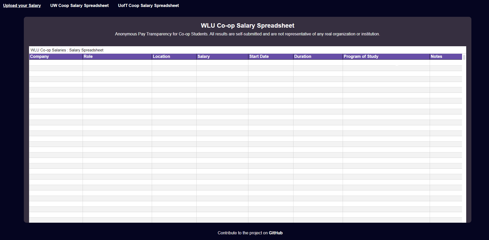

# WLU-coop-salary
Anonymous Pay Transparency for Co-op Students. All results are self-submitted and are not representative of any real organization or institution. 
> Forked from @Nathan903's [UofT Co-op Salary](https://github.com/Nathan903/UofT-coop-salary)

## How to Access

Access the salary spreadsheet using the the Github Pages link

## How to Contribute

To contribute and support pay transparency fill out the [**WLU Co-op Salary Google Form**](https://forms.gle/C77VGzzMcTQwMtB48)

## How to request a Removal

To request a removal, please create a [**Git issue**](https://github.com/jwizzlejosh/WLU-coop-salary/issues/new) in this repository 

> *Thanks to everyone for Contributing <3*
